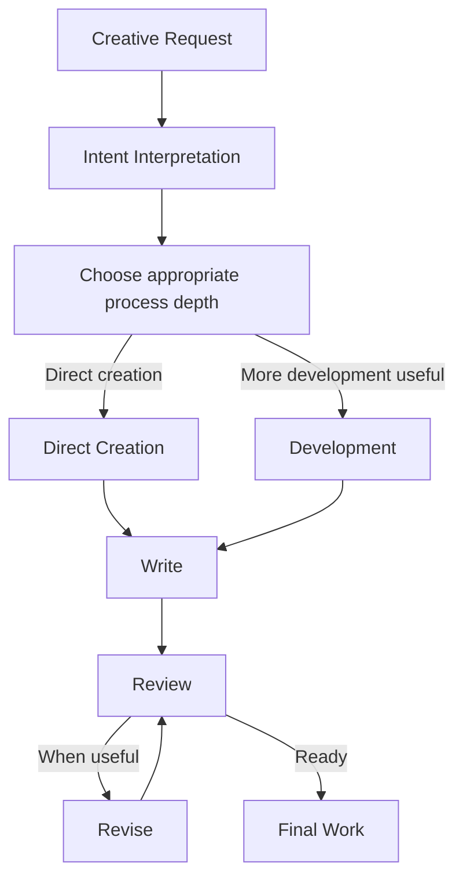
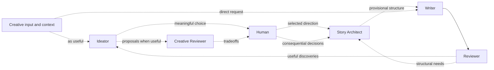
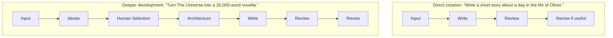
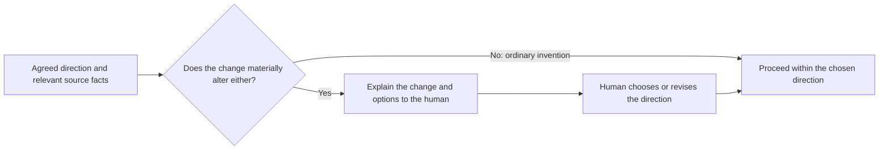
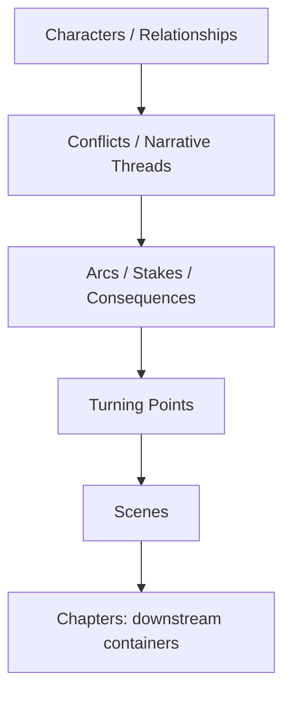
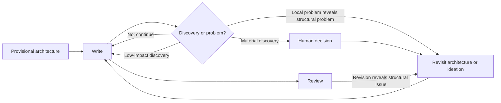
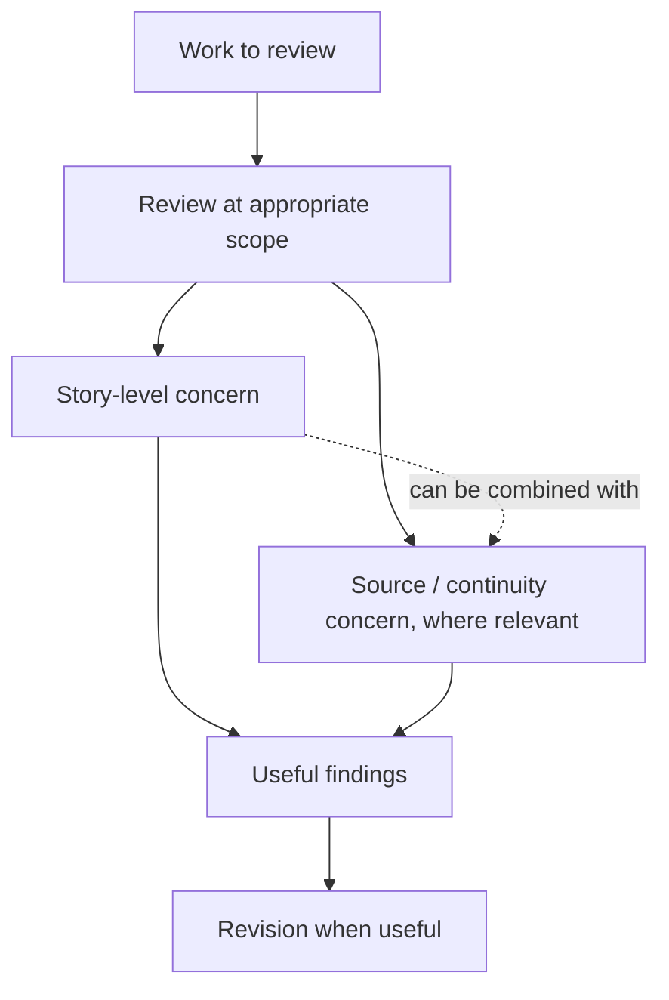
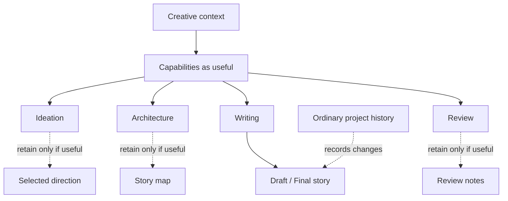
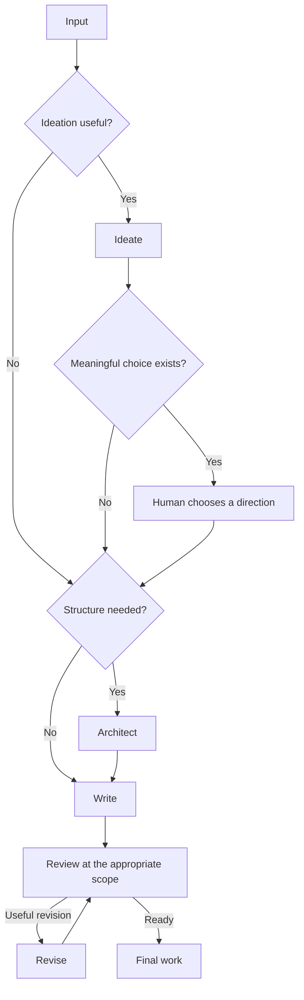

# Sequel Flow Architecture

## 1. Purpose

Sequel Flow is an intent-driven way to develop stories with AI. It helps turn
a creative request into a story with enough invention, structure, and review
for the work at hand, while preserving the constraints that matter to the
writer.

Its central balance is to protect important creative intent and source facts
without treating invention as a problem to eliminate. It is not an
approval-heavy workflow: a request should not have to pass through every
capability, agent, session, or document before prose can be written.

## 2. Design principles

- **Intent over ceremony:** infer the useful amount of process from the
  request; do not make users operate the workflow.
- **Creativity before premature structure:** explore story possibilities
  before fixing them into an outline when exploration would help.
- **Structure serves the story:** use architecture to make a story work, not
  to prescribe every moment of prose.
- **Capabilities, not mandatory roles:** a capability is a kind of work, not
  necessarily a distinct agent, session, stage, or artifact.
- **Provisional architecture:** writing may reveal a better story; structure
  can change when the benefit warrants it.
- **Human authority, autonomous craft:** people decide consequential
  creative direction; ordinary invention and prose choices proceed without
  repeated approval.
- **Review improves the story:** evaluate narrative effect as well as
  consistency, rather than optimizing for rule compliance.
- **Useful artifacts only:** keep documents when they help people create,
  collaborate, or remember important context—not because a stage occurred.
- **Proportionate process:** a short scene and a long source-based novella
  should not receive the same treatment.

## 3. Creative input and intent

The starting point may be an existing story or manuscript, a premise, idea,
character, scene, setting, theme, any combination of these, or a simple
natural-language request. An existing source is optional.

Sequel Flow first interprets what the user wants: for example, a finished
scene, an exploratory conversation, several possible directions, development
of a new idea, continuation of existing work, or a long-form story. It then
chooses the least elaborate path likely to serve that intent. If a consequential
ambiguity in the request prevents useful work, it can ask; otherwise, it should
make reasonable ordinary creative choices and begin.

Source relationships such as expansion, sequel, prequel, companion,
inspired-by, and original work can help interpret intent. They are guidance,
not mandatory modes, forms, schemas, or workflow selections. A user can
describe a hybrid or leave the relationship implicit. See [Story
modes](story-modes.md) for the conceptual distinctions.

## 4. Intent-driven workflow

The conceptual flow begins with the request and adapts to it:

This is not a mandatory linear pipeline. The diagram shows a useful overview,
not required gates: capabilities may be combined, skipped, or revisited, and
review or revision may be lightweight or deep according to the request.

These are capabilities, not mandatory sequential stages. A request may invoke
only the Writer and Reviewer, or bring in the Ideator, Creative Reviewer,
human selection, or Architect as useful.

### Process depth

**Process depth** is the amount of ideation, structural planning, review, and
human involvement appropriate to the creative request. It is not a
user-facing workflow mode, enum, or required selection. It is an internal
design principle for scaling the work: a clear request for a short scene may
need little beyond writing and a brief review, while a source-based novella
may benefit from broad ideation, story architecture, and whole-story review.
The system should use the minimum depth likely to serve the user's intent,
without skipping development that the requested scope genuinely needs.

The path may be direct or developmental:

These are illustrative paths, not prescribed forms: direct creation can use
relevant context, and deeper development can loop or omit a capability when it
does not help.

## 5. Direct creation

A request such as “Write a short story about a day in the life of Oliver”
should be able to proceed directly from the request and relevant context to
writing and an appropriate review. Sequel Flow can preserve established facts
where applicable, invent ordinary story material, and make routine choices
without requiring ideation, human selection, formal architecture, or
persistent artifacts merely because those capabilities exist.

If the prompt leaves room for ordinary interpretation, the system should use
its judgment. It should involve the human when proceeding would require a
material change to an established fact or agreed direction, not to ask
permission for every incidental character, action, or transition.

## 6. Source relationship and creative status

When a source exists, its relationship to the requested work matters. An
expansion, sequel, prequel, companion, and inspired-by work make different
claims about what should carry forward. These relationships help establish
expectations but are not required labels or a fixed taxonomy.

The following distinctions are useful when a source is relevant:

- **Source canon:** facts or events the source establishes.
- **Approved adaptation:** an intentional, human-approved change or
  reinterpretation of source material.
- **Novel invention:** material created for the new work that the source does
  not establish.
- **Unresolved ambiguity:** something the source leaves open and the new work
  has not intentionally decided.

These are conditional concepts, not fields every project must fill. In
source-free work there may be no source canon or source ambiguity to track.
Fidelity does not mean minimal invention: a source-based story may need
substantial new material to become a complete work.

## 7. Ideation and creative review

Ideation is a capability for requests that benefit from exploring directions
before committing to prose or structure. It may generate possibilities for
characters, relationships, conflicts, settings, scenes, subplots, mysteries,
motivations, reversals, consequences, themes, motifs, and alternative
directions.

An actionable idea conveys enough narrative logic to see what changes, who
wants what, what resists them, what consequences may follow, and why the idea
could sustain the requested form. The Ideator should offer meaningfully
different possibilities—not merely surface variations—and may challenge or
replace the initial premise when that could produce a stronger story.

Ideation is iterative. A user can ask “Try again,” “Make it stranger,” “Make
it more character-driven,” “Give me darker possibilities,” or “Challenge the
premise.” The system should use that direction to explore anew, not require
the user to diagnose the prior set in procedural detail.

When a user engaged in ideation or development introduces a meaningful “what
if” or changes a motivation, pressure, premise mechanism, or consequence, the
system should treat it as a possible causal change rather than merely insert
it as surface content. It should explore meaningful downstream consequences
before settling a consequential direction, and make important tradeoffs
legible when useful. Cosmetic wording or surface changes can be incorporated
directly. The user may modify, reject, combine, or continue with the explored
direction; when no consequential choice remains, the system should proceed
autonomously. This does not require a formal causal trace, fixed number of
alternatives, artifact, or disclosure of private reasoning. A premise alone
does not trigger this behavior, and straightforward requests remain
straightforward.

Creative Review is an optional capability for assessing ideas when another
perspective is useful. It can consider narrative and character potential,
conflict, consequence, emotional and thematic value, originality within the
work, coherence, compatibility with a source where relevant, risks, and
whether the direction can sustain the requested form.

Review should explain tradeoffs, not silently select the safest idea or impose
its own preferred style. “This contradicts an established fact” is different
from “this is surprising or unconventional.” Surprise, ambiguity, productive
weirdness, and risk are not defects by themselves; a surprising idea should
not be rejected merely for being surprising.

## 8. Human creative authority

The human has authority over consequential creative choices: the broad
direction, major characters and conflicts, principal arcs, significant
structural changes, consequential source adaptations, and major resolutions
of source ambiguity.

Ordinary invention inside the selected direction remains autonomous. Escalate
when a proposed change would materially alter the agreed direction,
established source facts, or major outcomes—not simply because an idea is
new. The system should make the consequence clear and, where useful, offer
alternatives. Human choice is a meaningful creative decision, not a separate
approval ceremony for each capability.

## 9. Story architecture

Use architecture when complexity warrants it—for example, when the story has
multiple characters, consequential choices, interdependent threads, or a
long-form scope. It helps turn selected possibilities into a causal and
dramatic story rather than a collection of attractive ideas.

Architecture may reason about characters, desires, relationships, conflicts,
stakes, consequences, narrative and thematic threads, character and
relationship arcs, discoveries, reversals, decisions, crises, turning points,
resolutions, scenes, setup and payoff, and subplot function. These are
reasoning dimensions, not mandatory schema fields or a checklist every story
must complete.

Chapters are downstream containers, not the primary unit of invention:

The architecture should be no more detailed than drafting needs. It can be a
short story spine, a scene sequence, or a broader map; it need not prescribe
every line, beat, or chapter boundary.

## 10. Architecture-to-draft loop and writing

Architecture is provisional. During writing, the Writer may discover a better
scene, stronger motivation, more compelling turn or ending, structural
weakness, or unexpected productive direction. It should be able to surface
the discovery and continue autonomously for low-impact changes. Material
changes to agreed direction, source canon, or major outcomes return to the
human for a decision.

Revision is not limited to the exact passage that prompted review. A local
problem may reveal that a scene, thread, or architecture needs to change.

The Writer follows the chosen direction and relevant established facts while
retaining room for discovery. Dialogue, sensory detail, transitions,
incidental characters, connective material, and scene-specific actions are
ordinary scene-level invention and do not require individual approval.

## 11. Review and revision

Review is proportionate to the requested work and may address two conceptual
concerns. They need not be separate agents, reports, or repeated stages.

The two concerns may be considered together or separately, by one reviewer or
more than one when independence is valuable. They are not mandatory
independent agents or repeated validation stages.

**Story-level review** asks whether the story is interesting; something
meaningfully changes; characters make consequential choices; causality holds;
conflicts develop; setups pay off; important threads resolve or remain open
intentionally; the ending works; and the work feels complete at its intended
scale.

**Source and continuity review**, where a source is relevant, considers
established facts, relationships, chronology, world rules, unintended
contradictions, and unintended resolution of ambiguity.

Story-level concerns take priority over minor mechanical observations.
Findings should be concrete and useful; not every observation requires human
adjudication. Review can lead to purposeful revision at the local, scene,
structural, architectural, or creative-direction level. A change of direction
chosen by the human may return the work to ideation. The process is iterative,
not a one-way pipeline.

## 12. Length and form

Length is a planning signal, not a padding target. A requested numeric range
should prompt the architecture to consider whether enough substantive
narrative material exists to support it. Narrative viability matters more
than filling a number; if the story's material naturally calls for a shorter
or longer form, surface that mismatch instead of manufacturing scenes or
compressing a viable story to fit.

A short-story request should not receive a novel-development process. A
long-form request may warrant deeper ideation, architecture, and whole-story
review. The process should scale with the work, not with the mere presence of
a word-count number.

## 13. Artifacts and provenance

Conceptual stages do not imply required artifacts. A creative brief, selected
direction, story architecture, draft, review notes, or final story may be
useful; create or retain them when they help the user, the collaboration, or
future writing. Otherwise, conversation and the work itself may be enough.

Git or the host application's ordinary history is sufficient provenance for
normal creative development. Hashes, manifests, ledgers, fingerprints,
schemas, and per-stage records are out of scope unless a concrete future need
justifies them. Capabilities do not imply artifacts; a useful artifact may be
retained, while the rest of the work can remain conversational or in the
story itself.

## 14. Roles and sessions

Ideator, Creative Reviewer, Story Architect, Writer, and Reviewer describe
responsibilities or capabilities, not necessarily separate agents or
sessions. One agent or conversation may perform several of them. A fresh
perspective or independent review may be useful for larger or higher-stakes
work, but separation should be chosen for demonstrable benefit, not
architectural purity. Sequel Flow does not prescribe session management.

## 15. Anti-goals

Sequel Flow deliberately does not:

- require workflow-mode selection for every request;
- require ideation or architecture for every story;
- require human approval for ordinary invention;
- treat every capability as a gate or mandatory agent;
- require a persistent artifact for every capability;
- equate source fidelity with minimal invention;
- optimize for compliance at the expense of story quality;
- use word count as a substitute for narrative substance; or
- introduce validation or provenance machinery without a concrete need.

## 16. Minimal viable workflow

The minimum useful pattern is:

Actual requests may skip ideation, human selection, or architecture. For a
straightforward request, the path may simply be **Input → Write → Review →
Revise if useful**.

## 17. Examples

The paths below are likely capabilities, not required procedures.

| Request | Likely path | Intentionally skipped |
|---|---|---|
| “Write a short story about a day in the life of Oliver.” | Use relevant context, write directly, and review the short story at an appropriate scope. | Formal ideation, selection, architecture, and persistent planning artifacts unless the request or context makes them useful. |
| “Give me three possible sequels to *The Universe*.” | Interpret the source relationship, ideate three meaningfully different directions, and optionally assess their tradeoffs. | Full story architecture and prose drafting; the requested output is possibilities. |
| “Turn *The Universe* into a 20,000-word novella.” | Clarify consequential source expectations if needed; ideate substantive story material; select a direction; architect enough causality, scenes, and arcs to support the requested form; write and review the whole story. | Chapter-first decomposition, exhaustive approvals, and invention minimization. If the story material cannot plausibly support the requested length, raise that before drafting rather than padding. |
| “I have an idea about a woman who remembers the future. Help me develop it.” | Explore distinct premises, conflicts, character motivations, and consequences; review tradeoffs if useful; let the human choose a direction; architect if development continues. | Source-canon tracking when no source is involved, and prose drafting until requested or useful. |
| “Write a scene where Oliver meets someone who knows about the pen.” | Use applicable context and established facts, make ordinary scene-level inventions, write the scene, and review it locally. | Formal ideation and whole-story architecture unless the meeting materially changes the larger story direction. |

These examples illustrate the central test: a user can get a short story without
being led through unnecessary process, while a long source-based request
receives enough invention and structural development to make its scope
narratively plausible.
